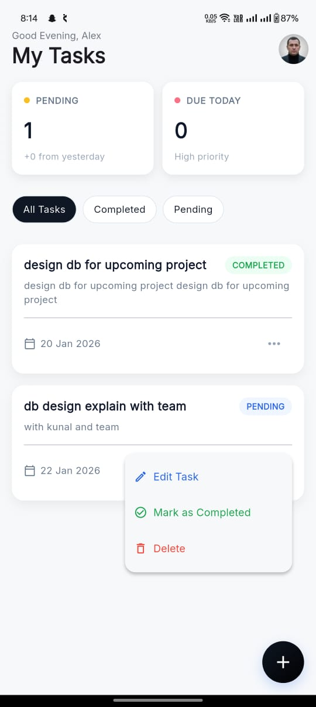
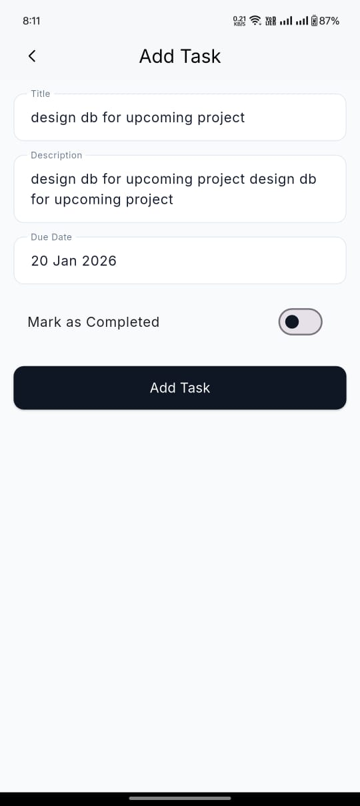
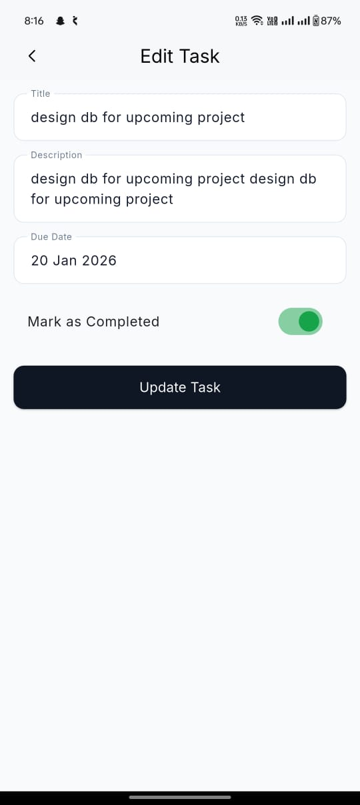
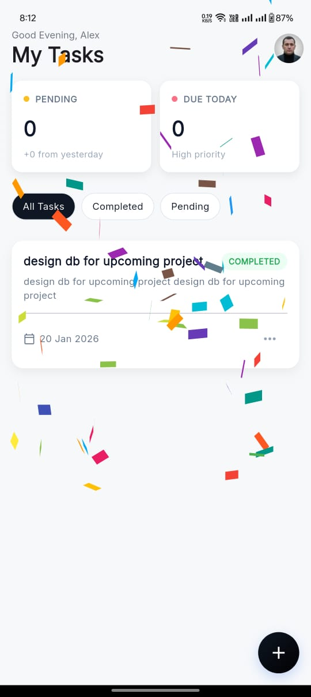
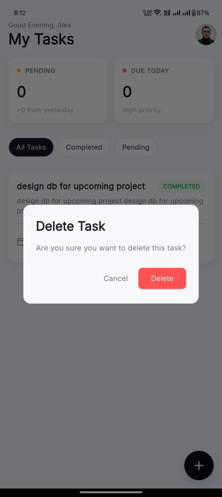
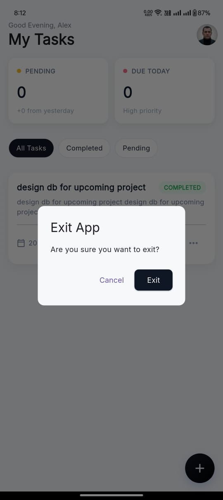

# 📋 Task Management App (Flutter)

A simple and clean **Task Management App** built using **Flutter**.  
The app allows users to **create, edit, delete, complete, and filter tasks**, with **local data persistence** and smooth UI interactions.

---

## ✨ Features

### ✅ Task Management
- Create new tasks with:
  - Title
  - Description
  - Due Date
  - Status (Pending / Completed)
- Edit existing tasks
- Delete tasks with confirmation dialog
- Mark tasks as completed

### 🔍 Task Filtering
- View **All Tasks**
- View **Completed Tasks**
- View **Pending Tasks**

### 💾 Data Persistence
- Uses **Hive (local database)** to store tasks
- Data remains intact even after app restart

### 🎨 UI & UX
- Clean and modern UI
- Material Design principles
- Smooth animations
- Confirmation dialogs for critical actions
- Exit confirmation on back press

---

## 📱 Screenshots

### 🏠 Task List Screen
Displays all tasks with status, due date, and filters.



---

### ➕ Add Task Screen
Create a new task with all required details.



---

### ✏️ Edit Task Screen
Edit task title, description, due date, and status.



---

### 🎉 Mark Task as Completed
Shows animation when task is marked completed.



---

### 🗑️ Delete Task Confirmation
Confirmation popup before deleting a task.



---

### 🚪 Exit App Confirmation
Asks user confirmation before exiting the app.



---

## 🧠 State Management

- **Provider** is used for state management
- Centralized `TaskProvider` handles:
  - Task list
  - Filtering
  - CRUD operations
  - UI updates

---

## 🗄️ Local Storage

- **Hive** is used as a lightweight local database
- Tasks are stored locally and loaded on app startup

---

## 🛠️ Tech Stack

- **Flutter**
- **Dart**
- **Provider**
- **Hive**
- **Material UI**

---

## 🚀 How to Run the Project

```bash
git clone <repository-url>
cd taskmanager
flutter pub get
flutter run
